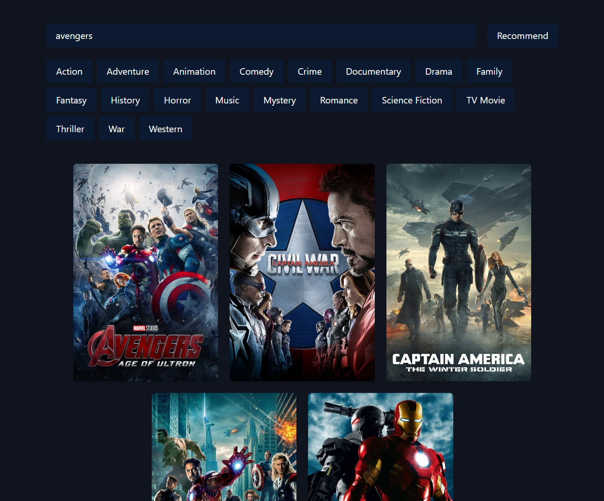

<!-- ABOUT THE PROJECT -->
# Movie Recommendation App


This **Movie Recommendation App** is a web application that utilizes the Sentence Transformers library to generate embeddings and recommend movies based on their similarity. 
Frontend is built with `React` and for backend with `FastAPI` and uses Sentence Transformers for text embedding and a recommendation model to suggest relevant movies from the TMDB dataset.

Use the `README.md` to get started.

<!-- BUILT WITH -->
# Built With

The Tech Stacks used are:

<div align="center">
  <a href="https://skillicons.dev">
      
  </a>
</div>

## Installation

1. Clone the repository to your local machine:

   ```bash
   git clone https://github.com/Chetan3327/movie-recommendation-app.git
   ```
2. Navigate to the frontend directory:

   ```bash
   cd frontend
   ```
3. Install dependencies:

   ```bash
   npm install
   ```
4. Navigate to the backend directory:

   ```bash
   cd backend
   ```
5. Install dependencies:

   ```bash
   pip install -r requirements.txt
   ```

<!-- CONTACT -->
# Contact

Name: Chetan Chauhan - chauhanchetan12789@gmail.com

Project Link: https://movie-recommendation-app-3327.netlify.app/
